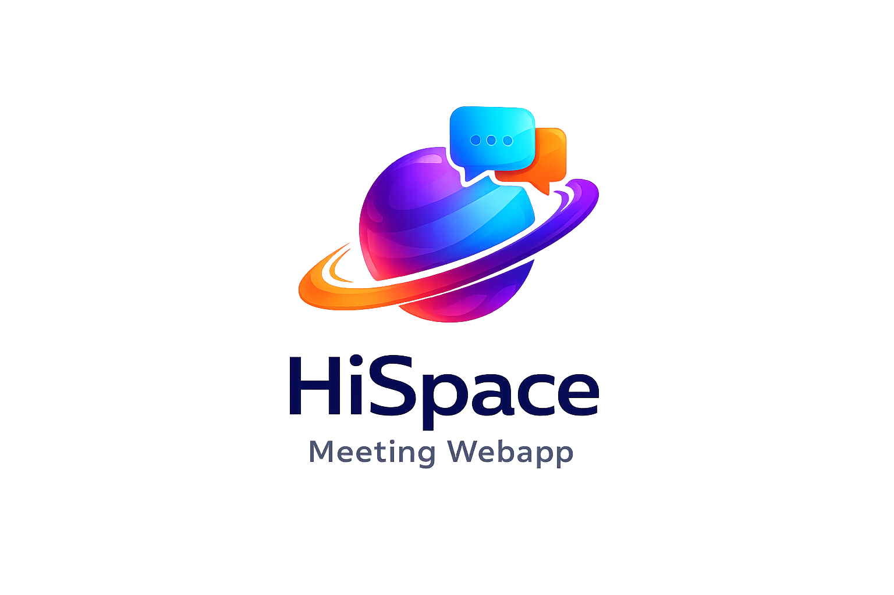

# HiSpace P2P - Modern Video Conferencing Platform

<div align="center">



**Free WebRTC browser-based video conferencing solution**

[](https://choosealicense.com/licenses/agpl-3.0/)
[](https://nodejs.org/)
[](https://www.npmjs.com/)

[Features](#-features) • [Quick Start](#-quick-start) • [Deployment](#-deployment) • [Documentation](#-documentation) • [Support](#-support)

</div>

---

## 📖 About

HiSpace P2P is a modern, open-source video conferencing platform built with WebRTC technology. It provides crystal-clear video calls, screen sharing, chat, and collaboration features - all without requiring downloads, plugins, or user accounts.

### Key Highlights

- 🆓 **100% Free** - Open source under AGPLv3 license
- 🚀 **No Downloads** - Works entirely in your browser
- 🔒 **Secure** - End-to-end encryption and privacy-focused
- ⚡ **Fast** - Peer-to-peer architecture for low latency
- 🎨 **Modern UI** - Beautiful, responsive interface
- 🌍 **Multi-language** - Supports 133+ languages
- 📱 **Cross-platform** - Works on desktop, tablet, and mobile

---

## ✨ Features

### Core Features

- ✅ **HD Video Calls** - Up to 8K resolution at 60fps
- ✅ **Audio Streaming** - Crystal-clear audio with noise suppression
- ✅ **Screen Sharing** - Share your screen in high quality
- ✅ **Real-time Chat** - Built-in messaging with emoji support
- ✅ **File Sharing** - Drag-and-drop file transfer
- ✅ **Recording** - Record meetings and save for later
- ✅ **Whiteboard** - Collaborative whiteboard for presentations
- ✅ **Room Locking** - Password-protected rooms
- ✅ **Unlimited Rooms** - Create as many rooms as you need
- ✅ **No Time Limits** - Unlimited meeting duration

### Advanced Features

- 🤖 **ChatGPT Integration** - AI-powered chat assistance
- 🎤 **Speech Recognition** - Voice-to-text captions
- 📸 **Snapshot** - Capture video frames as images
- 🎨 **Custom Themes** - Personalize your interface
- 🔐 **JWT Authentication** - Secure token-based auth
- 📊 **REST API** - Full API for integrations
- 🔗 **OIDC Support** - OpenID Connect authentication
- 📧 **Email Notifications** - Alert system for events

---

## 🚀 Quick Start

### Prerequisites

- **Node.js** 18.0.0 or higher ([Download](https://nodejs.org/))
- **npm** (comes with Node.js)
- **OpenSSL** (for SSL certificates)

### Installation

```bash
# Clone the repository
git clone https://github.com/miroslavpejic85/hispace.git
cd hispace

# Install dependencies
npm install

# Create environment file
cp .env.template .env
# Edit .env with your settings

# Create config file
cp app/src/config.template.js app/src/config.js
# Edit config.js for branding (optional)

# Generate SSL certificates
cd app/ssl
openssl genrsa -out key.pem 2048
openssl req -new -key key.pem -out csr.pem
openssl x509 -req -days 365 -in csr.pem -signkey key.pem -out cert.pem
rm csr.pem
cd ../..

# Start the server
npm start
```

Open [http://localhost:3000](http://localhost:3000) in your browser.

### Development Mode

```bash
# Run with auto-reload
npm run start-dev
```

---

## ⚙️ Configuration

### Environment Variables

Create a `.env` file in the root directory:

```env
# Server Configuration
PORT=3000
HOST=http://localhost:3000

# Security (Change these in production!)
JWT_KEY=your-secret-jwt-key-change-me
API_KEY_SECRET=your-api-secret-change-me

# Host Protection
HOST_PROTECTED=false
HOST_USER_AUTH=false
HOST_USERS=[{"username": "admin", "password": "securepassword"}]

# STUN/TURN Servers (Required for external connections)
STUN_SERVER_ENABLED=true
STUN_SERVER_URL=stun:stun.l.google.com:19302
TURN_SERVER_ENABLED=false
# TURN_SERVER_URL=turn:your-turn-server.com:3478
# TURN_SERVER_USERNAME=username
# TURN_SERVER_CREDENTIAL=password

# Features
CHATGPT_ENABLED=false
CHATGPT_APIKEY=your-openai-api-key
SENTRY_ENABLED=false
SENTRY_DSN=your-sentry-dsn

# Optional: OIDC Authentication
OIDC_ENABLED=false
OIDC_ISSUER_BASE_URL=https://your-oidc-provider.com
OIDC_CLIENT_ID=your-client-id
OIDC_CLIENT_SECRET=your-client-secret
```

### Branding Configuration

Edit `app/src/config.js` to customize:

- App name and logo
- Colors and themes
- Feature toggles
- UI button visibility
- Custom HTML injection

---

## 🌐 Deployment

### Option 1: Docker (Recommended)

```bash
# Pull the official image
docker pull hispace/p2p:latest

# Create docker-compose.yml
cp docker-compose.template.yml docker-compose.yml

# Edit docker-compose.yml with your settings

# Start the container
docker-compose up -d

# View logs
docker-compose logs -f
```

### Option 2: Vercel

```bash
# Install Vercel CLI
npm install -g vercel

# Login
vercel login

# Deploy
vercel

# Set environment variables
vercel env add HOST
vercel env add JWT_KEY
# Add other variables as needed
```

**Note**: Vercel has limitations with WebSocket connections. For production WebRTC applications, consider Railway, Render, or DigitalOcean.

### Option 3: Railway

1. Go to [Railway](https://railway.app)
2. Click "New Project" → "Deploy from GitHub"
3. Select your repository
4. Add environment variables
5. Deploy automatically

### Option 4: Self-Hosting (Ubuntu)

```bash
# Automated installation script
wget -qO p2p-install.sh https://docs.hispace.com/scripts/p2p/p2p-install.sh \
  && chmod +x p2p-install.sh \
  && ./p2p-install.sh
```

### Option 5: Cloud Platforms

- **Heroku**: Use Heroku CLI or GitHub integration
- **DigitalOcean**: Deploy via App Platform
- **AWS**: Use EC2 or Elastic Beanstalk
- **Google Cloud**: Use Cloud Run or Compute Engine

---

## 📚 Usage

### Starting a Meeting

1. Open your deployed instance (e.g., `http://localhost:3000`)
2. Click "Start Meeting" or go to `/newcall`
3. Enter a room name
4. Click "Join Room"
5. Allow camera and microphone access
6. Share the room URL with participants

### Direct Join URL

```
https://yourdomain.com/join?room=meeting-room&name=YourName&audio=1&video=1
```

**Parameters:**
- `room` - Room ID (required)
- `name` - Your display name
- `audio` - Enable audio (0/1)
- `video` - Enable video (0/1)
- `screen` - Enable screen share (0/1)
- `chat` - Enable chat (0/1)
- `token` - JWT token (if authentication enabled)

### API Endpoints

#### Get Server Statistics

```bash
curl -X GET "http://localhost:3000/api/v1/stats" \
  -H "authorization: your-api-secret" \
  -H "Content-Type: application/json"
```

#### Create Meeting

```bash
curl -X POST "http://localhost:3000/api/v1/meeting" \
  -H "authorization: your-api-secret" \
  -H "Content-Type: application/json"
```

#### Join Meeting

```bash
curl -X POST "http://localhost:3000/api/v1/join" \
  -H "authorization: your-api-secret" \
  -H "Content-Type: application/json" \
  --data '{
    "room": "test-room",
    "name": "John Doe",
    "audio": true,
    "video": true
  }'
```

Full API documentation available at: `http://localhost:3000/api/v1/docs`

---

## 🛠️ Development

### Project Structure

```
hispace/
├── app/
│   ├── api/          # REST API endpoints
│   ├── src/          # Server source code
│   └── ssl/          # SSL certificates
├── public/           # Frontend assets
│   ├── css/         # Stylesheets
│   ├── js/          # Client-side JavaScript
│   ├── images/      # Images and icons
│   └── views/       # HTML templates
├── tests/           # Test files
├── package.json     # Dependencies
└── server.js        # Entry point
```

### Available Scripts

```bash
# Start production server
npm start

# Start development server (with auto-reload)
npm run start-dev

# Run tests
npm test

# Lint code
npm run lint

# Docker commands
npm run docker-build    # Build Docker image
npm run docker-pull     # Pull from Docker Hub
npm run docker-run      # Run container
```

### Contributing

1. Fork the repository
2. Create a feature branch (`git checkout -b feature/amazing-feature`)
3. Commit your changes (`git commit -m 'Add amazing feature'`)
4. Push to the branch (`git push origin feature/amazing-feature`)
5. Open a Pull Request

**Before submitting:**
- Run `npm run lint` to format code
- Ensure all tests pass
- Update documentation if needed

---

## 🔒 Security

### Production Checklist

- [ ] Change default `JWT_KEY` and `API_KEY_SECRET`
- [ ] Set strong passwords in `HOST_USERS`
- [ ] Enable `HOST_PROTECTED` for production
- [ ] Use HTTPS (SSL certificates)
- [ ] Configure firewall (ports 80, 443, 3000)
- [ ] Set up regular backups
- [ ] Keep dependencies updated
- [ ] Enable rate limiting
- [ ] Configure CORS properly
- [ ] Use environment variables for secrets

### Security Features

- ✅ XSS protection
- ✅ CSRF protection
- ✅ Rate limiting
- ✅ JWT authentication
- ✅ Password protection
- ✅ IP whitelisting (optional)
- ✅ OIDC integration

---

## 📖 Documentation

- [API Documentation](http://localhost:3000/api/v1/docs) - Swagger UI
- [Self-Hosting Guide](docs/self-hosting.md)
- [STUN/TURN Setup](docs/coturn.md)
- [Ngrok Setup](docs/ngrok.md)
- [Official Docs](https://docs.hispace.com/hispace-p2p/)

---

## 🐛 Troubleshooting

### Port Already in Use

```bash
# Find process using port 3000
sudo lsof -i :3000
# Kill process
sudo kill -9 <PID>
```

### SSL Certificate Issues

```bash
# Regenerate certificates
cd app/ssl
openssl genrsa -out key.pem 2048
openssl req -new -key key.pem -out csr.pem
openssl x509 -req -days 365 -in csr.pem -signkey key.pem -out cert.pem
rm csr.pem
```

### WebSocket Connection Issues

- Check firewall settings
- Verify STUN/TURN server configuration
- Ensure HTTPS is properly configured
- Check browser console for errors

### Docker Issues

```bash
# Rebuild container
docker-compose down
docker-compose up -d --force-recreate

# Check logs
docker-compose logs -f
```

---

## 🆘 Support

- **Discord Community**: [Join our Discord](https://discord.gg/rgGYfeYW3N)
- **GitHub Issues**: [Report Issues](https://github.com/miroslavpejic85/hispace/issues)
- **Documentation**: [Full Documentation](https://docs.hispace.com/)
- **Email**: miroslav.pejic.85@gmail.com

---

## 📄 License

This project is licensed under the **AGPL-3.0 License**.

- **Open Source**: Free for open source use under AGPLv3
- **Commercial**: Purchase license from [CodeCanyon](https://codecanyon.net/item/hispace-p2p-webrtc-realtime-video-conferences/38376661)

See [LICENSE](LICENSE) file for details.

---

## 🙏 Acknowledgments

- Built with ❤️ by [Miroslav Pejic](https://www.linkedin.com/in/miroslav-pejic-976a07101/)
- Inspired by the open-source community
- Powered by WebRTC, Socket.IO, and Express.js

---

## 🌟 Star History


---

## 📊 Stats

- ⭐ Stars: [View on GitHub](https://github.com/miroslavpejic85/hispace/stargazers)
- 🍴 Forks: [View on GitHub](https://github.com/miroslavpejic85/hispace/network/members)
- 📦 Downloads: [View on npm](https://www.npmjs.com/package/hispace)

---

<div align="center">

**Made with ❤️ by the HiSpace Team**

[Website](https://p2p.hispace.com) • [Documentation](https://docs.hispace.com) • [Discord](https://discord.gg/rgGYfeYW3N) • [GitHub](https://github.com/miroslavpejic85/hispace)

</div>
